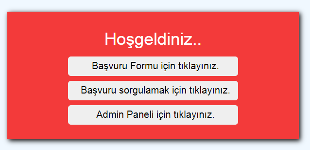

# Application Management System

## [Preview](https://ticket-app-test.netlify.app/)

</img>

### Built With

- React
- Javascript
- HTML5
- CSS3
- Context API
- React Router
- Firebase
- React Testing Library
- React Hook Form
- Yup
- Eslint

### Application query

You can use create an application or you can directly query an example application with these codes:

- 3lUDurp2IZZHliEKtnvz
- RCqWLhiA7wqdC2a28XOS

### Admin Login

For admin login, you should use :

- Username:kodluyoruz
- Password:bootcamp109

## Bitirme projesi

### Başvuru / ticket yönetim sistemi

#### Genel Açıklama

Uygulamamız herkese açık bir başvuru formunun son kullanıcı tarafından doldurulması ile başlıyor.
Formu dolduran kullanıcıya başvurusunu takip edebilecegi bir kod veriliyor. Kullanıcı başvuru durumu sayfasından bu kod ile başvurusunun çözülüp çözülemedigini kontrol edebiliyor.

Kullanıcı adı ve şifre ile girilebilen bir ekrandan da yetkili kullanıcılar gelen başvuruları görüntüleyebiliyor cevaplanmamış başvurulara cevap yazıp durumunu çözüldü / iptal edildi / bekliyor vb gibi güncelleyebiliyor. Gerekirse eski kayıtlara ulaşabiliyor.

#### Detaylı Açıklama

##### Routes / Paths

- /basvuru-olustur (default)

  - Public endpoint.
  - Başvuru formunu herhangi bir kullanıcının doldurmasına imkan verir.
  - Başvuru formunda [Ad, Soyad, Yaş, TC, Başvuru Nedeni, Adres Bilgisi, Fotograflar/Ekler, Gonder] butonu yer alır.

- /basvuru-basarili (Basvuru formu doldurulduktan sonra gelen sayfa)

  - Ekranda bir teşekkür mesajı yer alır ve kullanıcıya başvuru detayları ile birlikte başvuru kodu verilir.

- /basvuru-sorgula

  - Ekranda başvuru kodu girilebilen bir input ve sorgula butonu vardır.

- /basvuru/{basvuruNo}

  - Ekranda başvuru varsa bilgileri, son durumu ve verilen cevap(lar) yer alır.
  - Başvuru numarası hatalıysa 404(bulunamadı) mesajı çıkar.

- /admin

  - Ekranda kullanıcı giriş formu vardır. (Rahat test edebilmemiz için u:kodluyoruz, p:bootcamp109 bilgileri ile giriş yapabilmeliyim.)

- /admin/basvuru-listesi

  - Başarıli giriş sonrası bekleyen (çözülmemiş/cevaplanmamış) başvuruların listesi yer alır ve basit bilgiler sunar. (Başvuru yapan, tarih)
  - Başvuru listesinde her elemenda başvuruyu görüntüle butonu vardır.

- /admin/basvuru/{basvuruNo}
  - Başvurunun durumu güncellenebilir ve başvuruya cevap yazılabilir.
  - Burada yazılan cevap son kullanıci tarafından basvuru/{basvuruNo} kısmından görüntülenebilmelidir.

##### Gereklilikler

- React hooks
- Router (react-router/ reach router / etc)
- Context API
- Form management library (react-hook-form(önerilen) / formik / etc)
- Validation library (yup(önerilen), joi, etc)
- Tests (Unit test zorunlu, e2e opsiyonel)
- Uygulamanız kesinlikle bir servise deploy edilmiş olacak ve public link readme içinde yer alacak (netlify, vercel gibi)
- Open source
- Eslint

##### Dikkat edelim

- Tüm formlarda gerekli validasyonlar olsun.
- Back-end yazmak zorunda degilsiniz, back-end olarak firebase ya da mock bir api kullanabilirsiniz.
- Elinizden gelen en iyi şekilde seperation of concerns'e dikkat ederek yazın.
- Admin paneline u:kodluyoruz, p:bootcamp109 bilgileri ile giriş yapabilmeliyim.
- Mümkünse admin paneline bir menü ekleyelim (başvuru listesi, çıkıs gibi işlemleri kapsasın)

##### Bonus (Zorunlu degil, deneysel ozellikler)

- Typescript
- Service worker ile offline render destegi
- Mobil uyumlulu guzel bir tasarim
- Kullanilabilir UX

# Getting Started with Create React App

This project was bootstrapped with [Create React App](https://github.com/facebook/create-react-app).

## Available Scripts

In the project directory, you can run:

### `npm start`

Runs the app in the development mode.\
Open [http://localhost:3000](http://localhost:3000) to view it in the browser.

The page will reload if you make edits.\
You will also see any lint errors in the console.

### `npm test`

Launches the test runner in the interactive watch mode.\
See the section about [running tests](https://facebook.github.io/create-react-app/docs/running-tests) for more information.

### `npm run build`

Builds the app for production to the `build` folder.\
It correctly bundles React in production mode and optimizes the build for the best performance.

The build is minified and the filenames include the hashes.\
Your app is ready to be deployed!

See the section about [deployment](https://facebook.github.io/create-react-app/docs/deployment) for more information.

### `npm run eject`

**Note: this is a one-way operation. Once you `eject`, you can’t go back!**

If you aren’t satisfied with the build tool and configuration choices, you can `eject` at any time. This command will remove the single build dependency from your project.

Instead, it will copy all the configuration files and the transitive dependencies (webpack, Babel, ESLint, etc) right into your project so you have full control over them. All of the commands except `eject` will still work, but they will point to the copied scripts so you can tweak them. At this point you’re on your own.

You don’t have to ever use `eject`. The curated feature set is suitable for small and middle deployments, and you shouldn’t feel obligated to use this feature. However we understand that this tool wouldn’t be useful if you couldn’t customize it when you are ready for it.

## Learn More

You can learn more in the [Create React App documentation](https://facebook.github.io/create-react-app/docs/getting-started).

To learn React, check out the [React documentation](https://reactjs.org/).

### Code Splitting

This section has moved here: [https://facebook.github.io/create-react-app/docs/code-splitting](https://facebook.github.io/create-react-app/docs/code-splitting)

### Analyzing the Bundle Size

This section has moved here: [https://facebook.github.io/create-react-app/docs/analyzing-the-bundle-size](https://facebook.github.io/create-react-app/docs/analyzing-the-bundle-size)

### Making a Progressive Web App

This section has moved here: [https://facebook.github.io/create-react-app/docs/making-a-progressive-web-app](https://facebook.github.io/create-react-app/docs/making-a-progressive-web-app)

### Advanced Configuration

This section has moved here: [https://facebook.github.io/create-react-app/docs/advanced-configuration](https://facebook.github.io/create-react-app/docs/advanced-configuration)

### Deployment

This section has moved here: [https://facebook.github.io/create-react-app/docs/deployment](https://facebook.github.io/create-react-app/docs/deployment)

### `npm run build` fails to minify

This section has moved here: [https://facebook.github.io/create-react-app/docs/troubleshooting#npm-run-build-fails-to-minify](https://facebook.github.io/create-react-app/docs/troubleshooting#npm-run-build-fails-to-minify)
